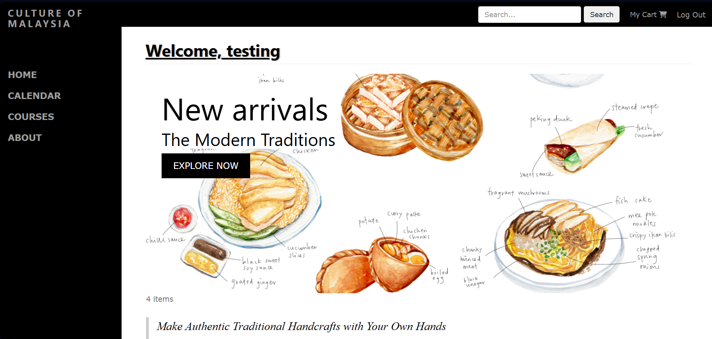
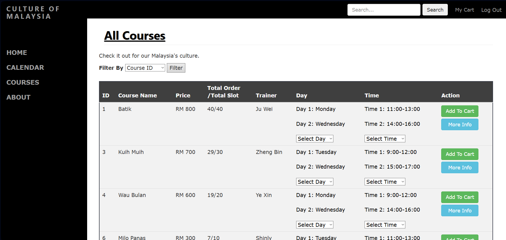
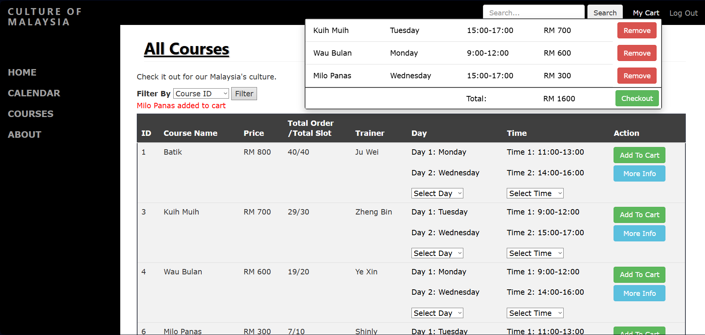
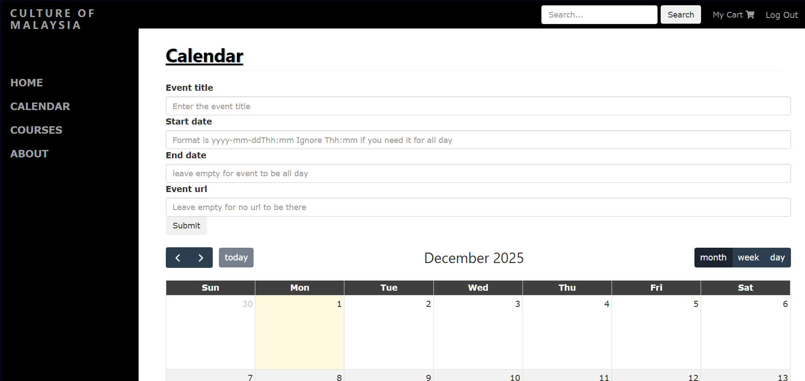
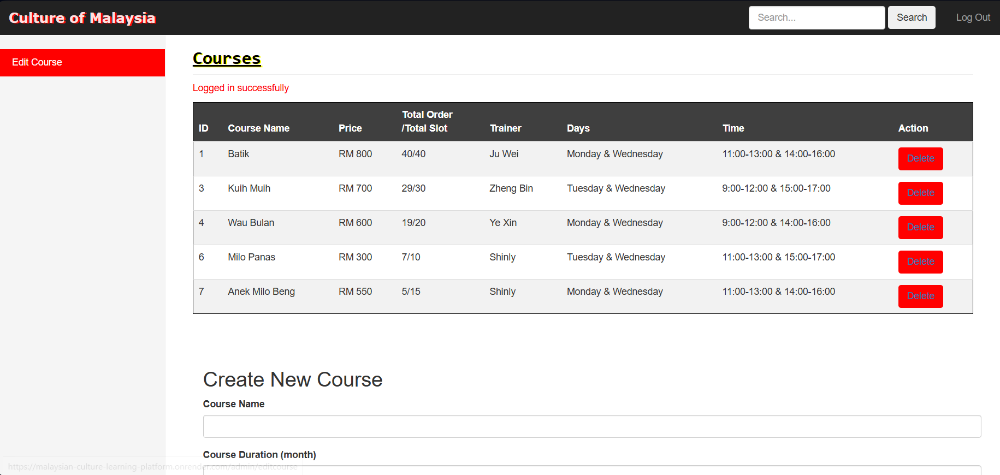
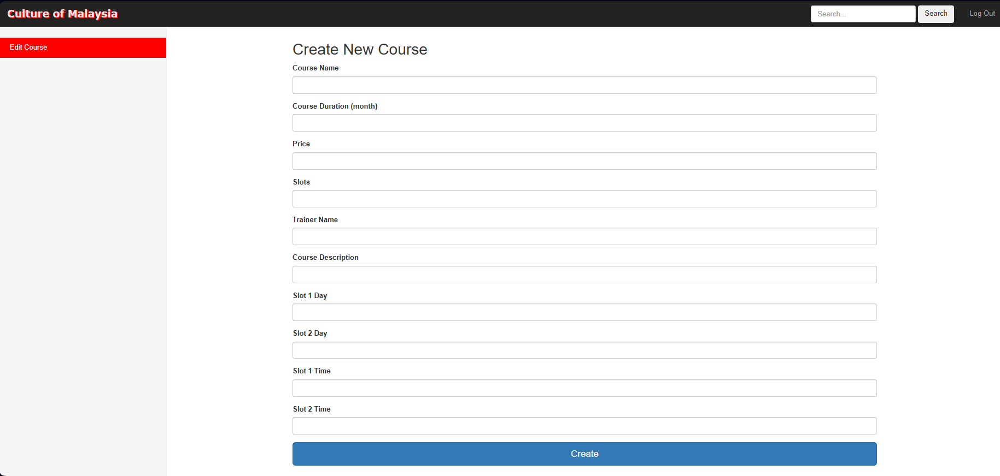

# Malaysian Culture Learning Platform

A Flask-based web application for learning and preserving Malaysian cultural heritage through interactive courses. Features user authentication, course management, shopping cart functionality, and real-time chat. Developed as part of the Mini IT project (Foundation Semester 3).

**Live Demo:** https://malaysian-culture-learning-platform.onrender.com/

---

## 🌐 Overview

This platform promotes Malaysian cultural education by offering structured courses on traditional arts, crafts, and practices. Users can browse courses (Batik painting, traditional crafts, cultural workshops), register for time slots, manage bookings via cart, and provide feedback. Admins can create, edit, and manage course offerings through a dedicated dashboard.

Built with Flask, SQLAlchemy, and Bootstrap for a responsive, user-friendly experience.

---

## 👥 Contributors

- Wong Ju Wei
- Shinly Eu
- Ter Zheng Bin
- Lim Ye Xin

---

## 📁 Repository Structure

```
Malaysian-Culture-Learning-Platform/
├── app.py                              # Main Flask application (routes, models, forms)
├── database.db                         # SQLite database (users, courses, orders, cart, feedback)
├── requirements.txt                    # Python dependencies
├── Procfile                            # Deployment config for platforms like Render/Heroku
├── .gitignore                          # Git ignore patterns
├── screenshots/                        # Optional README images (UI previews)
│   ├── home.png
│   ├── courses.png
│   ├── cart.png
│   ├── myplan.png
│   ├── admin-dashboard.png
│   └── edit-course.png
├── static/                             # Static assets (CSS, images)
│   ├── about.css
│   ├── admin.css
│   ├── base.css
│   ├── course.css
│   ├── dashboard.css
│   ├── mycart.css
│   ├── batik.jpg, kuih.jpg, wau bulan.jpg, etc.
│   └── (team member photos)
├── templates/                          # Jinja2 HTML templates
│   ├── index.html                      # Landing page
│   ├── login.html                      # User login
│   ├── signup.html                     # User registration
│   ├── dashboard.html                  # User dashboard
│   ├── course.html                     # Course catalog with search
│   ├── mycart.html                     # Shopping cart
│   ├── myplan.html                     # User's enrolled courses
│   ├── about.html                      # About the platform
│   ├── chatapp.html                    # Real-time chat interface
│   ├── admin/
│   │   ├── admindashboard.html         # Admin overview
│   │   ├── editcourse.html             # Create/edit courses
│   │   └── list.html                   # Manage existing courses
│   └── Includes/
│       └── items_modals.html           # Reusable course detail modals
├── building_user_login_system-master/  # Reference/tutorial materials
├── sqlite3.exe, sqldiff.exe, etc.      # SQLite utilities (Windows)
└── venv/                               # Virtual environment (not tracked)
```

---

## ✨ Features

### User Features
- **Authentication System** – Secure login/signup with Flask-Login and WTForms validation
- **Course Catalog** – Browse Malaysian culture courses with search functionality
- **Detailed Course Pages** – View course info (duration, price, trainer, schedule slots)
- **Shopping Cart** – Add courses to cart, select time slots, manage bookings before purchase
- **My Plan (Enrollment)** – View and track registered courses
- **Feedback System** – Submit reviews and suggestions
- **Real-Time Chat** – Communicate with other learners via Flask-SocketIO

### Admin Features
- **Admin Dashboard** – Overview of platform activity
- **Course Management** – Create, edit, delete courses with validation
- **User/Order Management** – View enrollments and manage user data
- **Dedicated Admin Login** – Role-based access control

### Technical Features
- **Flask Backend** – Lightweight, modular Python web framework
- **SQLAlchemy ORM** – Database abstraction for User, Course, Order, Cart, Feedback models
- **Bootstrap UI** – Responsive design with Flask-Bootstrap integration
- **Flask-SocketIO** – WebSocket support for live chat
- **SQLite Database** – Embedded, zero-config persistence
- **Form Validation** – WTForms with custom validators for email, length, number ranges
- **Session Management** – Flask-Login for user state and authentication

---

## 🧠 Key Concepts Demonstrated

- **MVC Architecture** – Separation of routes, models, and templates
- **ORM Relationships** – Foreign keys linking users to orders/cart items
- **Form Handling** – Server-side validation with FlaskForm classes
- **Authentication & Authorization** – Password-based login with role differentiation (User vs. Admin)
- **CRUD Operations** – Full lifecycle management for courses and user data
- **Real-Time Communication** – WebSocket-based chat with eventlet WSGI server
- **Deployment Best Practices** – Procfile, requirements.txt, environment config

---

## 🚀 Getting Started

### Prerequisites
- Python 3.11.9 (recommended; tested for dependency compatibility)
- pip (Python package manager)

### Local Setup

```powershell
# Clone repository
git clone https://github.com/juwei-w/Malaysian-Culture-Learning-Platform.git
cd Malaysian-Culture-Learning-Platform

# Create virtual environment (ensure Python 3.11.9)
py -3.11 -m venv venv  # Windows
.\venv\Scripts\activate
# macOS/Linux:
# python3.11 -m venv venv && source venv/bin/activate

# Install dependencies
pip install -r requirements.txt

# Initialize database (if database.db doesn't exist)
python
>>> from app import db, app
>>> with app.app_context():
>>>     db.create_all()
>>> exit()

# Run application
python app.py
```

Visit `http://localhost:5000` in your browser.

### Live Deployment
The application is deployed at: **https://malaysian-culture-learning-platform.onrender.com/**

---

## 🔐 Demo Accounts

These demo accounts are automatically created if they do not already exist (plaintext passwords for evaluation only):

User Account:
- Email: `testing@gmail.com`
- Password: `testtest`

Admin Account:
- Email: `admin@admin.com`
- Password: `admin123`

Notes:
- Do not reuse these credentials elsewhere.
- Admin account allows course management actions; data may be modified by other testers.
- For production, implement password hashing (e.g., Werkzeug `generate_password_hash`) and remove hardcoded demo passwords.

---

## 🗂 Database Schema

### User
- `id` (Primary Key)
- `type` (User | Admin)
- `username`, `email`, `password`

### Course
- `course_id` (Primary Key)
- `course_name`, `course_duration`, `course_price`, `course_slot`
- `course_trainer`, `course_info`
- `course_slot_1_day`, `course_slot_1_time`, `course_slot_2_day`, `course_slot_2_time`
- `course_order` (sort priority), `course_date_created`

### Order
- `order_id`, `user_id`, `course_name`, `slot_day`, `slot_time`

### Cart
- `cart_id`, `user_id`, `course_name`, `course_price`, `slot_day`, `slot_time`

### Feedback
- `feedback_id`, `user_name`, `feedback`

---

## 🎨 User Flow

1. **Landing Page** – Introduction to Malaysian cultural courses
2. **Sign Up / Log In** – Create account or authenticate
3. **Browse Courses** – Search and filter available courses
4. **Add to Cart** – Select preferred time slot and add course
5. **Checkout Cart** – Review and confirm enrollment
6. **My Plan** – View enrolled courses and schedules
7. **Chat** – Engage with community in real-time
8. **Feedback** – Share experience and suggestions

### Admin Flow
1. **Admin Login** – Separate authentication for administrators
2. **Admin Dashboard** – Platform metrics and management overview
3. **Create/Edit Courses** – Add new offerings or update existing ones
4. **Manage Users/Orders** – View enrollments and user activity

---

## 🛠 Technology Stack

- **Backend:** Flask 2.2.5, Flask-SQLAlchemy 3.0.5, Flask-Login 0.6.2
- **Frontend:** HTML5, CSS3, Bootstrap (via Flask-Bootstrap 3.3.7.1)
- **Real-Time:** Flask-SocketIO 4.3.1, eventlet 0.33.1
- **Database:** SQLite 3 (SQLAlchemy ORM)
- **Forms:** Flask-WTF 1.2.1, WTForms 3.0.1, wtforms-validators 1.0.0
- **Deployment:** Gunicorn 21.2.0, Render (or Heroku-compatible platforms)

---

## 📊 Sample Operations

- **User Registration:** Form validation → create User record → redirect to login
- **Course Search:** Query Course table by name filter → render matching results
- **Add to Cart:** Select slot → create Cart entry → persist until checkout
- **Admin Course Creation:** Validate CourseForm → insert into Course table → refresh dashboard
- **Real-Time Chat:** SocketIO event (`message`) → broadcast to all connected clients

---

## 🧪 Testing Recommendations

- **Unit Tests:** Validate form validators, model methods, route logic
- **Integration Tests:** Test user flows (signup → login → add to cart → checkout)
- **Security Tests:** SQL injection attempts, XSS payloads, brute-force login
- **UI Tests:** Selenium/Playwright for end-to-end browser automation
- **Load Tests:** Simulate concurrent users with Locust or JMeter

---

## 📦 Dependencies Highlights

```
Flask==2.2.5                  # Web framework
Flask-SQLAlchemy==3.0.5       # ORM
Flask-Login==0.6.2            # Authentication
Flask-SocketIO==4.3.1         # WebSockets
Flask-Bootstrap==3.3.7.1      # UI framework
WTForms==3.0.1                # Form handling
gunicorn==21.2.0              # WSGI server for production
eventlet==0.33.1              # Async networking for SocketIO
```

Full list: [requirements.txt](requirements.txt)

---

## 🔗 Resources

- **Repository:** https://github.com/juwei-w/Malaysian-Culture-Learning-Platform
- **Issues:** https://github.com/juwei-w/Malaysian-Culture-Learning-Platform/issues
- **Flask Documentation:** https://flask.palletsprojects.com/
- **SQLAlchemy Docs:** https://docs.sqlalchemy.org/

---

## 📸 Screenshots

*(Optional: Add screenshots here to showcase the UI. Example structure:)*

<details>
<summary><strong>User Interface</strong></summary>

**Landing Page**  


**Course Catalog**  


**My Cart**  


**My Plan (Enrolled Courses)**  


</details>

<details>
<summary><strong>Admin Interface</strong></summary>

**Admin Dashboard**  


**Edit Course**  


</details>

---

## 📝 Academic Context

**Course:** Mini IT  
**Program:** Foundation in IT  
**Semester:** 3 (August 2022 – November 2022)  
**Institution:** MMU (Multimedia University)

This project demonstrates practical application of web development fundamentals, database design, and software engineering principles in a culturally relevant context.

---

*Mini IT • Foundation • Aug 2022 - Nov 2022*
